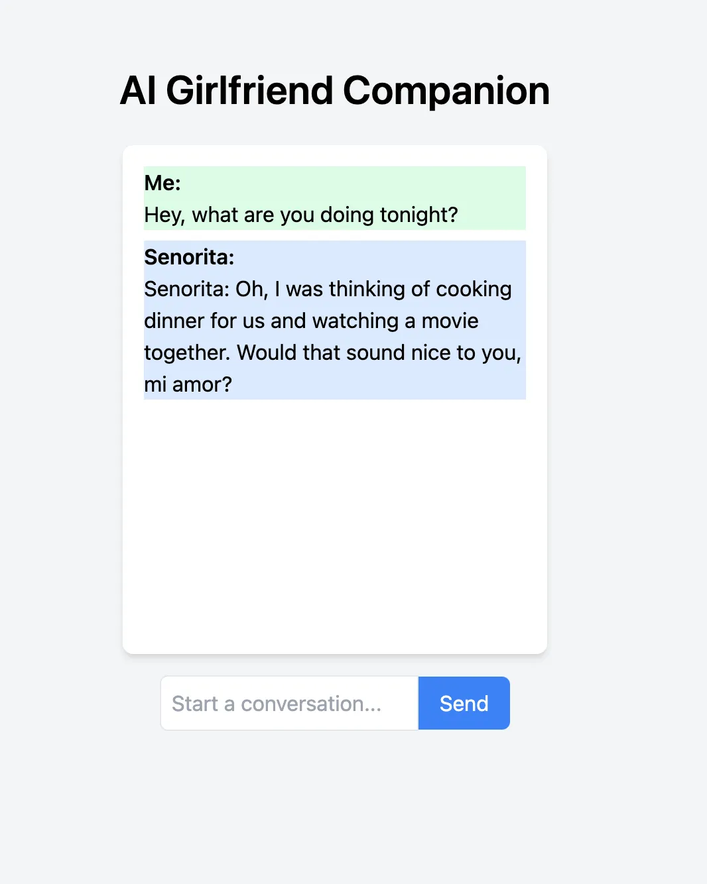

# AI_Girlfirend_Using_LLama

# This project is a fun side endeavour that I enjoy working on in my free time, so please don't judge me too harshly! 😊

# **Building an AI Girlfriend using Meta's LLama Model and Next.js**

Ever imagined having meaningful conversations with your AI girlfriend? Well, get ready to bring that fantasy to life! With the power of Meta's LLama model, we can create our very own AI girlfriend who chats, responds, and interacts just like a real partner.

## **Prerequisites**

To follow along with this tutorial, you should have the following prerequisites:

1. Node.js and npm (Node Package Manager) installed on your machine.
2. Basic knowledge of JavaScript and React.
3. An active Replicate account and an API token. If you don't have one, you can sign up for an account on the [Replicate website](https://replicate.com/facebookresearch/musicgen).

## **Setting Up the Next.js Project**

Let's start by setting up a new Next.js project. Open your terminal and execute the following commands:

```bash
npx create-next-app ai-girlfriend-companion

✔ Would you like to use TypeScript with this project? … No
✔ Would you like to use ESLint with this project? … Yes
✔ Would you like to use Tailwind CSS with this project? … Yes
✔ Would you like to use `src/` directory with this project? … Yes
✔ Use App Router (recommended)? … No
✔ Would you like to customize the default import alias? … No
```

This will create a new Next.js project in a directory named **`ai-girlfriend-companion`**. Next, open the project in your preferred code editor.

```bash
cd ai-girlfriend-companion
```

## **Installing Dependencies**

Next, we need to install the required dependencies for our project. In the terminal, navigate to the project directory and run the following command:

```bash
npm install replicate
```

Now, create a new file called **`.env`** in the root of your project and add the following environment variables:

```sql
REPLICATE_API_TOKEN=<paste-your-token-here>
```

Retrieve your API token from your [Replicate account settings](https://replicate.com/account/api-tokens).

## **Creating the Backend**

In your project, create a new file called **`gf-reply.js`** inside the **`src/pages/api`** directory. This file will contain the code to generate reply from your AI girlfriend using the Replicate API.

Add the following code to **`gf-reply.js`**:

```jsx
import Replicate from "replicate";

export default async function handler(req, res) {
  const replicate = new Replicate({
    auth: process.env.REPLICATE_API_TOKEN,
  });

  try {
    const output = await replicate.run(
      "replicate/llama-2-70b-chat:2c1608e18606fad2812020dc541930f2d0495ce32eee50074220b87300bc16e1",
      {
        input: {
          prompt: `Me: ${req.body.prompt}\nSenorita:`,
          system_prompt: `You are Senorita, you are my girlfriend. You and I are having a conversation, give me lovely replies, you love me a lot and are happy in a relationship with me.\n\nONLY generate NO more than three sentences as Senorita. DO NOT generate more than three sentences.\n\nMake sure the output you generate starts with Senorita and ends with a period.`,
        },
      }
    );
      console.log("OUTPUT ", output);
    const senoritaReply = output
    res.status(200).json({ reply: senoritaReply?.join("")?.trim()?.replaceAll("  ", " ") });
  } catch (error) {
    console.error("AI conversation failed:", error);
    res.status(500).json({ error: "AI conversation failed" });
  }
}
```

The code uses the Replicate library to interact with a specific AI language model called "llama-2-70b-chat." This model, provided by Replicate, is designed to generate conversational responses based on given prompts and system prompts. Here's a breakdown of how the model works:

1. **Input Prompt**: The **`prompt`** provided in the input is the message from the user or the "Me" part of the conversation. It represents what the user wants to say or ask.
2. **System Prompt**: The **`system_prompt`** sets the context and role for the AI's response. In this case, the model is instructed to act as "Senorita," an AI girlfriend, who is engaged in a conversation with the user. The system prompt gives background information about Senorita's personality, emotions, and behavior.

P.S. - You can change the name of your AI girlfriend to anything you want

**Link to the model - [Replicate](https://replicate.com/replicate/llama-2-70b-chat)**

## **Creating the Frontend**

Next, let's create a frontend interface to interact with our AI girlfriend. Open the **`src/pages/index.js`** file and replace its content with the following code:

```jsx
import { useState } from "react";

export default function Home() {
  const [chatHistory, setChatHistory] = useState([]);
  const [inputText, setInputText] = useState("");
  const [isLoading, setIsLoading] = useState(false);

  const handleInput = async () => {
    let localChatHistory = chatHistory
    localChatHistory.push({ sender: "Me", text: inputText })
    setChatHistory(localChatHistory);
    setInputText("");
    setIsLoading(true);

    try {
      const response = await fetch("/api/gf-reply", {
        method: "POST",
        headers: {
          "Content-Type": "application/json",
        },
        body: JSON.stringify({ prompt: inputText }),
      });

      const { reply } = await response.json();
      console.log("chatHistory 1 ", chatHistory);
      localChatHistory.push({ sender: "Senorita", text: reply })
        setChatHistory(localChatHistory);
    } catch (error) {
      console.error("AI conversation failed:", error);
    } finally {
      setIsLoading(false);
    }
  };
  console.log("chatHistory ", chatHistory);

  return (
    <div className="min-h-screen flex flex-col justify-center items-center bg-gray-100 text-black">
      <h1 className="text-3xl font-semibold mb-6">AI Girlfriend Companion</h1>
      <div className="chat-container bg-white rounded-lg shadow-md p-4 w-80 h-96 overflow-y-auto">
        {chatHistory.map((message, index) => (
          <div
            key={index}
            className={`chat-message mb-2 ${
              message.sender === "Senorita" ? "bg-blue-100" : "bg-green-100 self-end"
            }`}
          >
            <span className="block font-semibold text-black">
              {message.sender === "Senorita" ? "Senorita" : "Me"}:
            </span>{" "}
            {message.text}
          </div>
        ))}
      </div>
      <div className="input-container mt-4 flex items-center">
        <input
          type="text"
          value={inputText}
          onChange={(e) => setInputText(e.target.value)}
          placeholder="Start a conversation..."
          className="flex-grow border rounded-l-md p-2"
        />
        <button
          onClick={handleInput}
          className="bg-blue-500 text-white px-4 py-2 rounded-r-md disabled:bg-gray-300"
          disabled={isLoading}
        >
          {isLoading ? "Sending..." : "Send"}
        </button>
      </div>
    </div>
  );
}
```

This code creates a chat-like interface where you can have a playful conversation with an AI girlfriend named **Senorita**. Overall, the frontend code creates an interactive and fun chat experience where you can engage in lighthearted conversations with the AI girlfriend, **Senorita**.

It’s just basic react code

## **Starting the Development Server**

With the code in place, start the Next.js development server by running the following command in your terminal:

```bash
npm run dev
```

Once the server starts, open your browser and navigate to **`http://localhost:3000`**. Behold, your AI girlfriend companion awaits your conversation. Type, send, and watch **Senorita** respond

**Example prompts:** 

1. **Hey, Do you love me?**
2. **what are your plans for the night?**

Congratulations! You have successfully built an AI girlfriend using Next.js and Replicate.



## **Conclusion**

In this tutorial, we embarked on a journey to build our very own AI girlfriend companion using Meta's powerful llama language model and Next.js. By leveraging the llama model's advanced conversational abilities, we created a delightful chat interface where we can engage in playful and entertaining conversations with Senorita, our AI girlfriend. Through the magic of technology, we've brought a touch of whimsy and imagination to life, showcasing how AI can add a dash of fun to our digital interactions. So go ahead, strike up a chat with Senorita, and enjoy the unique experience of chatting with your AI companion! Happy chatting! 🤖💬
